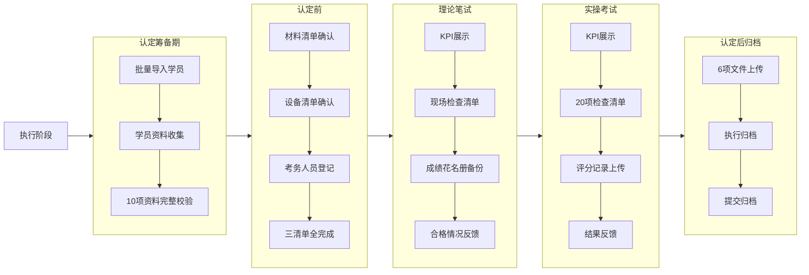
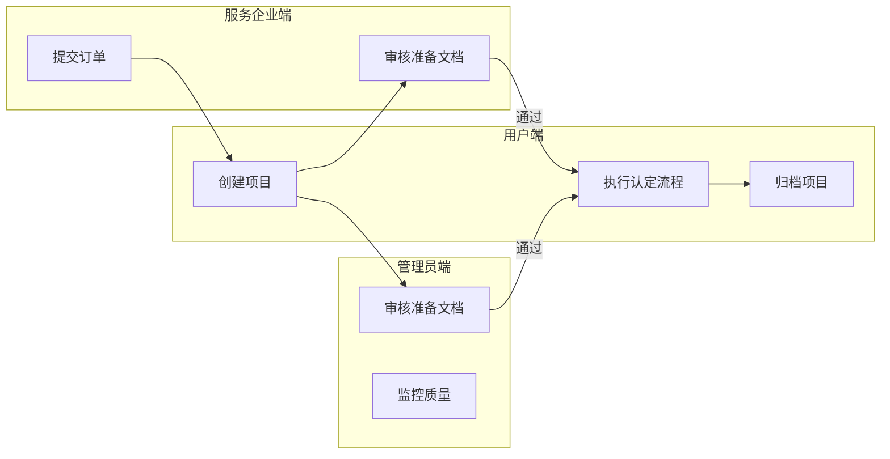

# 认定管理系统 - 产品需求文档 (PRD)

> **版本：** V1.0  
> **状态：** 已定稿  
> **创建日期：** 2026-04-29  
> **文档类型：** 产品需求文档（Product Requirements Document）

---

## 目录

1. [文档说明](#1-文档说明)
2. [产品背景与目标](#2-产品背景与目标)
3. [用户角色定义](#3-用户角色定义)
4. [产品范围与边界](#4-产品范围与边界)
5. [全局约束与规范](#5-全局约束与规范)
6. [业务流程图](#6-业务流程图)
7. [功能需求详述](#7-功能需求详述)
8. [非功能需求](#8-非功能需求)
9. [数据实体定义](#9-数据实体定义)
10. [验收标准](#10-验收标准)
11. [附录](#11-附录)

---

## 1. 文档说明

### 1.1 编写目的

本文档旨在明确「职业技能认定管理系统」的产品需求，为后续系统设计、开发实施、测试验证提供统一的参考依据。本文档面向产品团队、设计团队、开发团队、测试团队及项目干系人。

### 1.2 适用范围

- 覆盖职业技能认定管理系统的**全生命周期管理功能**
- 涵盖：订单管理、项目管理、认定执行流程（筹备→认定前→笔试→实操→归档）、数据面板、资料档案
- 不含：移动端适配、国际化（i18n）、多租户权限体系（当前版本聚焦单组织内使用）

### 1.3 参考文档

| 文档名称 | 说明 |
|----------|------|
| 原型页面功能需求说明.md（V3） | 原型功能点详细说明 |
| 前期准备业务逻辑.md | 项目准备阶段业务逻辑说明 |
| 整体工作流程.md | 全局工作流程说明 |
| 补充需求.md | 补充需求说明 |
| 需求2.md / 新文件1.md | 执行阶段需求说明 |
| 项目策划任务书.xlsx | 项目章程Excel模板 |
| 项目成员表.xlsx | 项目成员Excel模板 |
| 项目WBS表.xlsx | WBS分解Excel模板 |
| 项目进度计划表.xlsx | 进度计划Excel模板 |
| 项目风险管理表.xlsx | 风险评估Excel模板 |

### 1.4 术语定义

| 术语 | 说明 |
|------|------|
| 认定 | 职业技能等级认定的简称 |
| 项目 | 针对某工种/等级的一次认定活动的组织单元 |
| 学员 | 报名参加认定考试的个人 |
| 筹备期 | 认定执行阶段的第一个子阶段，核心为学员管理与资料收集 |
| 认定前 | 认定执行阶段的第二个子阶段，核心为考前材料/设备/人员准备 |
| KPI | 关键绩效指标，用于展示考试核心结果 |
| WBS | 工作分解结构（Work Breakdown Structure） |
| Toast | 页面顶部短暂出现的提示消息 |

---

## 2. 产品背景与目标

### 2.1 业务背景

当前职业技能认定工作流程依赖线下纸质文档和分散的Excel表格管理，存在以下痛点：

- **信息分散**：项目信息散落在多个Excel文件中，难以统一检索与追踪
- **流程割裂**：认定流程各阶段缺乏线上化流转机制，依赖人工沟通推进
- **材料分散**：学员资料、考试材料、归档文件缺乏统一存储与状态管理
- **监控缺失**：管理层无法实时掌握认定项目的整体进度与健康度
- **校验薄弱**：检查清单的完整性缺乏系统级强制校验，易出现遗漏

### 2.2 产品目标

构建一套面向职业技能认定机构的**全流程线上化管理系统**，实现：

1. **项目全生命周期管理**：从订单接收到项目归档的闭环管理
2. **认定流程标准化**：确保每个阶段的操作规范、可追溯
3. **数据集中可视化**：通过数据面板实时掌握组织运营状况
4. **过程管控强约束**：关键节点设置强制性校验规则，防止遗漏

### 2.3 成功指标

| 指标 | 目标值 | 衡量方式 |
|------|--------|----------|
| 项目归档率 | ≥ 90% | 归档项目数 / 启动项目数 |
| 认定流程完整执行率 | ≥ 85% | 完整走完5阶段的流程数 / 总流程数 |
| 学员资料完整率 | ≥ 95% | 资料完整的学员数 / 学员总数 |
| 检查清单完成率 | ≥ 95% | 已完成的检查项 / 总检查项 |

---

## 3. 用户角色定义

### 3.1 角色矩阵

| 角色 | 职责描述 | 核心操作 |
|------|----------|----------|
| **P0 系统管理员** | 系统配置与整体监控 | 查看数据面板、管理所有项目、系统设置 |
| **P1 项目经理（用户端）** | 认定项目的全流程执行人 | 创建项目、管理准备文档、执行认定流程、归档 |
| **P2 服务企业端** | 提交认定需求、审核项目文档 | 下单、审核项目章程/成员/WBS等 |
| **P3 管理员端（内部审核）** | 审核项目准备阶段文档 | 审核策划任务书、成员表、WBS等 |
| **P4 考评员/督导员** | 参与认定现场工作 | 在考务人员清单中登记信息 |

### 3.2 角色-功能矩阵

| 功能模块 | 系统管理员 | 项目经理 | 服务企业端 | 内部管理员 | 考评员 |
|----------|:----------:|:--------:|:----------:|:----------:|:------:|
| 数据面板 | ✓ | ✓ 查看 | — | ✓ 查看 | — |
| 项目管理 | ✓ 全部 | ✓ 管辖 | — | — | — |
| 我要下单 | — | — | ✓ | — | — |
| 项目准备阶段 | ✓ 全部 | ✓ 执行 | ✓ 审核 | ✓ 审核 | — |
| 认定执行流程 | ✓ 查看 | ✓ 执行 | — | — | — |
| 资料档案 | ✓ 查看 | ✓ 查看 | — | — | — |

---

## 4. 产品范围与边界

### 4.1 In Scope（当前版本包含）

- **项目管理**：项目列表与检索、新增项目、订单转项目、项目工作台、删除项目
- **项目准备阶段**：项目策划任务书（章程）、项目成员表、WBS分解、进度计划、风险登记册的查看/编辑，企业+管理员审核流转
- **认定执行阶段-筹备期**：学员概览、学员CRUD、10项资料导入与状态跟踪
- **认定执行阶段-认定前**：3清单（材料/设备/考务人员）管理、总览聚合
- **认定执行阶段-理论笔试**：KPI展示、现场检查清单、成绩备份、合格情况反馈
- **认定执行阶段-实操考试**：KPI展示、20项检查清单（含上传+强制校验）、评分记录、结果反馈
- **认定后归档**：6项文件上传、进度联动、归档事项状态、执行归档、提交归档
- **数据面板**：站点地图、快捷入口、项目完成情况、流程健康度、归档监控、清单质量
- **资料档案**：考试材料/考场资料/考生资料的归档查看
- **订单管理**：我要下单（表单提交）、选择项目进入流程

### 4.2 Out of Scope（后续版本）

- 系统设置与管理（角色权限配置、用户管理）
- 移动端 App
- 消息通知与推送
- 电子签名/手写签批
- 在线支付与结算
- 试卷在线作答系统
- 第三方系统对接（如政府监管平台）

---

## 5. 全局约束与规范

### 5.1 界面规范

| 项目 | 规范 |
|------|------|
| 设计风格 | 以 Ant Design 为基准，主色 `#1890ff` |
| 布局结构 | 左侧导航栏 + 右侧内容区，导航栏支持展开/收起 |
| 最低分辨率 | 1280 × 720 |
| 字体栈 | `-apple-system, BlinkMacSystemFont, 'Segoe UI', Roboto, 'Helvetica Neue', Arial, sans-serif` |

### 5.2 交互规范

| 规则 | 说明 |
|------|------|
| 阻断提示 | 所有阻断性操作必须有 Toast 提示，文案为中文 |
| 二次确认 | 关键操作（提交、删除、归档）需二次确认弹窗 |
| 加载反馈 | 加载状态必须有反馈（loading 动画或骨架屏） |
| 分页默认 | 列表默认分页 20 条/页 |
| 防重复 | 提交/上传类按钮点击后置 disabled，防止重复提交 |

### 5.3 数据规范

| 项目 | 规范 |
|------|------|
| 存储方式 | 当前版本使用 `localStorage`，正式版本迁移至后端数据库 |
| 文件上传 | 当前为前端模拟，正式版本对接对象存储服务（返回可追踪文件ID） |
| 日期格式 | 统一为 `YYYY-MM-DD` |
| 数值格式 | 金额/数值使用千分位分隔 |
| 身份证号 | 列表展示时脱敏（`110***********1234`） |

### 5.4 状态一致性规则（强约束）

**规则一：实操检查清单提交规则**

- 20条勾选未完成 → 禁止提交
- 序号1-6附件未上传齐全 → 禁止保存草稿与提交

**规则二：认定后归档规则**

- 6项文件未上传齐 → 禁止执行归档、禁止提交归档
- 未执行归档 → 禁止提交归档

**规则三：全局表单校验**

- 必填项缺失 → 阻断提交并提示具体缺失字段名
- 校验时机：失焦校验 + 提交时全量校验

---

## 6. 业务流程图

### 6.1 整体业务流程图


### 6.2 认定执行阶段流程图



### 6.3 角色交互流程图



---

## 7. 功能需求详述

### 7.1 数据面板模块（`数据面板.html`）

#### 7.1.1 DB-01 站点分布地图

| 项目 | 内容 |
|------|------|
| **功能目标** | 以广西地图为底图，展示各市认定站点分布与容量概览 |
| **数据来源** | ECharts + DataV GeoJSON 广西地图数据 |
| **交互要求** | 至少展示14个地级市站点数据；鼠标悬浮显示Tooltip（城市名+站点数量）；地图可缩放、可拖拽 |
| **异常处理** | 地图加载失败时显示「地图加载失败，请检查网络连接」 |
| **验收标准** | 至少14个城市点可见；悬浮tooltip信息正确 |

#### 7.1.2 DB-02 快捷入口

| 项目 | 内容 |
|------|------|
| **功能目标** | 减少跨模块跳转成本 |
| **卡片** | 「项目准备」→ 跳转项目管理首页.html；「认定流程」→ 跳转认定流程首页.html；「系统设置」→ 占位提示 |
| **异常处理** | 占位功能必须给可识别提示（如「开发中」），防止误判系统卡死 |
| **验收标准** | 前两项100%跳转可达；系统设置固定提示 |

#### 7.1.3 DB-03 项目完成情况图

| 项目 | 内容 |
|------|------|
| **功能目标** | 展示项目状态结构占比 |
| **展示形式** | 饼图 + 图例 + tooltip占比 |
| **异常处理** | 数据为空时至少展示空态 |
| **验收标准** | 各扇区比例与指标值匹配 |

#### 7.1.4 DB-04 流程健康度

| 项目 | 内容 |
|------|------|
| **功能目标** | 快速识别哪个阶段拖慢整体推进 |
| **数据** | 五阶段完成率（筹备期/认定前/理论笔试/实操考试/归档），范围0~100 |
| **展示形式** | 柱状图，低值按预警色显示（< 30%红色，30%~60%橙色，> 60%正常） |
| **验收标准** | 五阶段均显示，标签与百分比准确 |

#### 7.1.5 DB-05 归档闭环监控

| 项目 | 内容 |
|------|------|
| **功能目标** | 判断归档工作是否闭环 |
| **数据** | 已完成/待复核/待备份数量 |
| **展示形式** | 环图 + 图例数量 |
| **验收标准** | 图例数量与扇区一致，颜色语义清晰；总量为0时显示空态 |

#### 7.1.6 DB-06 清单执行质量

| 项目 | 内容 |
|------|------|
| **功能目标** | 汇总理论与实操执行质量，突出风险项 |
| **展示** | 理论完成率/实操完成率/附件完整率三个指标卡 + 风险项标签（完整/缺失/待上传） |
| **异常处理** | 无风险项时显示「当前无风险项」 |
| **验收标准** | 指标卡与风险标签在同屏可见、状态语义正确 |

---

### 7.2 项目管理模块（`项目管理首页.html`）

#### 7.2.1 PM-01 项目列表与检索

| 项目 | 内容 |
|------|------|
| **功能目标** | 让用户快速定位并管理目标项目 |
| **展示形式** | 卡片列表 |
| **筛选条件** | 搜索词（名称/编号）、状态筛选（全部/进行中/待审核/已通过） |
| **卡片内容** | 项目名称、项目编号、项目经理、当前阶段、状态标签、项目来源 |
| **空态处理** | 无结果时展示引导文案「暂无项目，点击新增项目创建」 |
| **验收标准** | 任意组合筛选结果可复现 |

#### 7.2.2 PM-02 新增项目

| 项目 | 内容 |
|------|------|
| **功能目标** | 创建新项目并进入后续准备流程 |
| **表单字段** | 项目名称（必填）、项目编号（必填）、项目经理（必填）、当前阶段（只读）、项目来源（只读）、备注 |
| **校验规则** | 必填项缺失阻断提交并提示「请填写 XXX」 |
| **验收标准** | 成功新增后刷新仍可见（localStorage持久化） |

#### 7.2.3 PM-03 订单转项目

| 项目 | 内容 |
|------|------|
| **功能目标** | 将待接收订单快速转为执行项目 |
| **处理逻辑** | 订单状态变更为「已转项目」，生成项目记录 |
| **防重复** | 一次点击只生成一个项目，重复点击需防抖 |
| **验收标准** | 一次点击只生成一个项目记录 |

#### 7.2.4 PM-04 项目工作台

| 项目 | 内容 |
|------|------|
| **功能目标** | 项目内5项准备文档的统一入口 |
| **文档卡片** | 项目策划任务书、项目成员表、WBS分解、进度计划、风险登记册 |
| **状态显示** | 每项文档显示「未开始/进行中/已完成」 |
| **跳转** | 点击卡片进入对应查看页面，编辑按钮进入编辑页面 |

#### 7.2.5 PM-05 删除项目

| 项目 | 内容 |
|------|------|
| **功能目标** | 删除指定项目及其关联数据 |
| **安全要求** | 需二次确认「确认删除项目《项目名称》？」 |
| **结果** | 删除后刷新列表，localStorage中清除该项目所有数据 |

---

### 7.3 项目准备阶段

#### 7.3.1 PS-01 项目策划任务书（章程）

| 项目 | 内容 |
|------|------|
| **功能目标** | 定义项目目标、范围、关键信息 |
| **查看页** | 展示策划任务书全部字段，含提交审核按钮 |
| **编辑页** | 表单编辑，参照Excel模板`项目策划任务书.xlsx`的字段结构 |
| **审核流转** | 用户端编辑完成→提交→服务企业端审核→管理员端审核→通过进入下一环节/驳回退回修改 |

#### 7.3.2 PS-02 项目成员表

| 项目 | 内容 |
|------|------|
| **字段** | 姓名、角色、部门、联系方式、职责 |
| **参照模板** | `项目成员表.xlsx` |
| **审核流转** | 同PS-01 |

#### 7.3.3 PS-03 WBS分解

| 项目 | 内容 |
|------|------|
| **功能目标** | 工作分解结构管理 |
| **参照模板** | `项目WBS表.xlsx` |
| **审核流转** | 同PS-01 |

#### 7.3.4 PS-04 进度计划

| 项目 | 内容 |
|------|------|
| **功能目标** | 项目时间计划管理（甘特图风格） |
| **参照模板** | `项目进度计划表.xlsx` |
| **审核流转** | 同PS-01 |

#### 7.3.5 PS-05 风险登记册

| 项目 | 内容 |
|------|------|
| **功能目标** | 项目风险评估与管理 |
| **字段** | 风险项、概率（高/中/低）、影响等级（高/中/低）、应对措施 |
| **参照模板** | `项目风险管理表.xlsx` |
| **审核流转** | 同PS-01 |

#### 7.3.6 PS-06 审核机制

| 项目 | 内容 |
|------|------|
| **企业审核页面** | `enterprise-review.html`，服务企业端查看并审核准备文档 |
| **管理员审核页面** | `admin-review.html`，内部管理员端审核 |
| **审核操作** | 通过 → 进入下一环节；不通过 → 填写驳回意见退回修改 |
| **状态同步** | 审核结果写入localStorage，各页面读取状态显示 |

---

### 7.4 认定执行阶段 - 认定筹备期

#### 7.4.1 PR-01 筹备期概览

| 项目 | 内容 |
|------|------|
| **功能目标** | 展示筹备期整体完成情况与操作入口 |
| **统计卡** | 已导入学员数、未导入学员数、资料完整学员数 |
| **入口** | 学员信息管理、资料导入等 |

#### 7.4.2 PR-02 学员管理

| 项目 | 内容 |
|------|------|
| **功能目标** | 学员信息的增删改查 |
| **列表字段** | 序号、姓名、身份证号、报考等级、联系电话、资料状态（完整/不完整）、操作（编辑/导入资料） |
| **支持操作** | 批量导入学员（占位，点击提示「开发中」）、单个新增学员（弹窗表单）、编辑学员信息、删除学员（需确认） |
| **分页** | 默认20条/页 |
| **完成条件** | 所有学员的10项资料全部导入成功，筹备期标记为已完成 |

#### 7.4.3 PR-03 资料收集（每位学员）

| 项目 | 内容 |
|------|------|
| **功能目标** | 逐项管理学员的认定报名资料 |
| **基础材料（5项）** | 报名信息表、两寸证件照、身份证、学历、职业技能鉴定登记表 |
| **申报材料（5项）** | 工作年限证明、技师/高级技师考评申报表、业绩评估报告表、呈报表、工作方案 |
| **交互** | 每项独立导入按钮，状态显示「未导入/已导入」，进度计数 `x/10` |
| **额外说明** | 如为自备题目，需提前10个工作日完成命题、审题及专家签字，保密协议签订并回传存档 |

---

### 7.5 认定执行阶段 - 认定前

#### 7.5.1 PRE-01 认定前总览

| 项目 | 内容 |
|------|------|
| **功能目标** | 聚合展示三清单完成情况 |
| **统计** | 总完成项/总项（共20项），完成率百分比 |
| **状态一致性** | 总览数值必须与各子页面状态实时一致 |

#### 7.5.2 PRE-02 考试材料清单

| 项目 | 内容 |
|------|------|
| **功能目标** | 确认考前材料是否齐全 |
| **材料项（8项）** | 考试通知单、签到表、试卷、评分标准、应急预案、考场记录表、考生须知、考场规则 |
| **交互** | 逐项勾选确认，状态保存至localStorage |

#### 7.5.3 PRE-03 考试设备清单

| 项目 | 内容 |
|------|------|
| **功能目标** | 确保考场设备达标 |
| **设备项（8项）** | 考场计算机、实操设备、监控设备、广播设备、身份核验设备、应急设备、网络设备、其他设备 |
| **约束** | 每项需上传现场照片；未上传照片时不可标记为完成 |

#### 7.5.4 PRE-04 考务人员清单

| 项目 | 内容 |
|------|------|
| **功能目标** | 完整记录四类考务人员信息 |
| **人员类别** | 考评员、督导员、监考员、考务人员 |
| **字段** | 姓名、证件号、电话、单位、备注 |
| **操作** | 新增行、删除行、编辑信息、类别完成勾选 |
| **约束** | 姓名为空时需阻断类别完成操作 |

---

### 7.6 认定执行阶段 - 理论笔试

#### 7.6.1 TH-01 理论KPI展示

| 项目 | 内容 |
|------|------|
| **功能目标** | 展示理论考试核心结果指标 |
| **指标（4项）** | 考试报名人数、实考人数、合格人数、通过率（%） |
| **展示形式** | 四个指标卡，数值突出显示 |
| **异常处理** | 数据缺失时显示占位值「—」 |

#### 7.6.2 TH-02 理论考试现场工作检查清单

| 项目 | 内容 |
|------|------|
| **功能目标** | 记录现场检查结果 |
| **字段** | 考场编号、监考人员、考试时间、考场环境检查、监控设备检查、试卷密封检查、考生身份核验、备注 |
| **交互** | 新增/修改按钮切换，数据保存至localStorage |

#### 7.6.3 TH-03 成绩花名册备份记录

| 项目 | 内容 |
|------|------|
| **功能目标** | 上传备份成绩花名册 |

#### 7.6.4 TH-04 合格情况反馈表

| 项目 | 内容 |
|------|------|
| **功能目标** | 填写考试合格情况 |
| **字段** | 考试报名人数、实考人数、合格人数、不合格人数、通过率 |

---

### 7.7 认定执行阶段 - 实操考试

#### 7.7.1 PRAC-01 实操KPI展示

| 项目 | 内容 |
|------|------|
| **功能目标** | 展示实操考试核心结果指标 |
| **指标（4项）** | 考试报名人数、实考人数、合格人数、通过率（%） |
| **展示形式** | 同TH-01 |

#### 7.7.2 PRAC-02 实操考试检查清单（20项）

| 项目 | 内容 |
|------|------|
| **功能目标** | 完整记录实操现场检查情况 |
| **第1-6项** | 需上传现场图片作为证据，上传后显示「已上传：文件名」 |
| **第7-20项** | 每行「已完成/未完成」单选，同行互斥 |
| **统计** | 已勾选数、已完成数、未完成数 |
| **草稿保存规则** | 1-6项附件全部上传是保存草稿的前提条件，否则阻断并提示 |
| **提交规则** | 20项全部勾选 + 1-6项附件齐全 → 方可提交；阻断时提示「请完成所有检查项并上传附件」 |
| **验收** | 20行均可独立正确记录；附件不齐绝不允许保存成功 |

#### 7.7.3 PRAC-03 考试过程和评分记录

| 项目 | 内容 |
|------|------|
| **功能目标** | 上传考试过程的评分记录文件 |

#### 7.7.4 PRAC-04 考试结果反馈表

| 项目 | 内容 |
|------|------|
| **交互** | 同TH-04合格情况反馈表 |

---

### 7.8 认定后归档（`认定后归档.html`）

#### 7.8.1 ARCH-01 六项文件上传

| 项目 | 内容 |
|------|------|
| **文件项** | f1: 考试试卷；f2: 学员理论答题卡；f3: 学员实操笔答试卷；f4: 实操成绩汇总及评分表；f5: 考试报名资料与考场组织检查记录；f6: 成绩花名册备份记录 |
| **交互** | 每项独立上传/重新上传按钮，显示状态「待上传」或「已上传：文件名」 |
| **上传中** | 按钮置disabled，防重复提交 |

#### 7.8.2 ARCH-02 进度联动

| 项目 | 内容 |
|------|------|
| **功能目标** | 实时反映归档完成程度 |
| **显示** | `x/6` + 百分比进度条 |
| **异常** | 状态回退时进度同步回退 |

#### 7.8.3 ARCH-03 归档事项状态联动

| 项目 | 内容 |
|------|------|
| **事项** | a1: 考试报名资料归档（待归档→已归档）；a2: 考试试卷归档（待归档→已归档）；a3: 考务文件归档（待归档→已归档）；a4: 交接明细目录（待生成→已生成） |
| **联动规则** | 上传数量达到阈值时自动更新状态，不能提前完成 |

#### 7.8.4 ARCH-04 执行归档

| 项目 | 内容 |
|------|------|
| **前置条件** | 6项文件全部上传 |
| **操作** | 点击「执行归档」按钮 |
| **结果** | 按钮文本变为「归档完成」，置disabled，状态写入localStorage |
| **防重复** | 已执行归档后按钮禁用，防止重复点击 |

#### 7.8.5 ARCH-05 提交归档

| 项目 | 内容 |
|------|------|
| **前置条件** | (1) 6项文件全部上传；(2) 已执行归档 |
| **操作** | 点击「提交归档」 |
| **结果** | 流程闭环完成，跳转至认定流程首页 |
| **阻断** | 不满足任一前置条件均阻断并提示具体原因 |

---

### 7.9 资料档案模块

#### 7.9.1 DOC-01 考试材料（`考试材料.html`）

展示已归档考试材料列表，支持查看动作（当前占位）。无数据时展示空态。

#### 7.9.2 DOC-02 考场资料（`考场资料.html`）

展示已归档考场资料，按项渲染状态与基本信息。状态缺失时默认「待补充」。

#### 7.9.3 DOC-03 考生资料（`考生资料.html`）

展示已归档考生资料列表。缺少字段时保持页面可用。

---

### 7.10 订单模块

#### 7.10.1 OR-01 我要下单（`我要下单.html`）

| 项目 | 内容 |
|------|------|
| **功能目标** | 采集企业认定需求并形成订单记录 |
| **字段** | 工种/职业名称（必填）、认定等级（必填：五级/四级/三级/二级/一级）、计划认定人数（必填）、期望开考月份、联系人及说明 |
| **校验** | 必填项缺失阻断提交，逐字段提示「请填写 XXX」 |
| **结果** | 提交成功 → 生成订单记录，Toast提示「提交成功」 |

#### 7.10.2 SP-01 选择项目与进入流程（`选择项目.html`）

| 项目 | 内容 |
|------|------|
| **功能目标** | 从项目池中选择要执行认定流程的项目 |
| **筛选** | 状态筛选、等级筛选 |
| **交互** | 点击「进入流程」→ 保存当前项目上下文至localStorage → 跳转认定流程首页 |
| **防御** | 未选中项目时禁止进入 |

---

## 8. 非功能需求

### 8.1 性能要求

| 指标 | 要求 |
|------|------|
| 页面加载时间（首屏） | ≤ 3秒 |
| 列表渲染 | 1000条数据内无卡顿 |
| 图表渲染 | ≤ 2秒 |
| 用户操作响应 | ≤ 1秒 |

### 8.2 可用性要求

- 所有阻断场景必须有中文提示文案
- 关键操作（删除、提交、归档）需有二次确认弹窗
- 表单校验在失焦和提交时均触发
- 全局导航不超过3级深度
- 所有可点击元素需有 hover 状态反馈

### 8.3 兼容性要求

| 浏览器 | 最低支持版本 |
|--------|-------------|
| Google Chrome | ≥ 90 |
| Microsoft Edge | ≥ 90 |
| Mozilla Firefox | ≥ 90 |

### 8.4 安全要求

- 用户输入需做 HTML 转义，防 XSS 攻击
- 身份证号等敏感信息在列表展示时需脱敏（如 `110***********1234`）
- 文件上传需限制类型（仅图片和PDF/Word/Excel）与大小（图片 ≤ 10MB，文档 ≤ 50MB）

### 8.5 可维护性要求

- 前端代码采用模块化组织，JavaScript 逻辑按功能分层
- 状态管理集中化（当前版本使用 `localStorage` + 统一读写函数 `readState`/`writeState`）
- Excel 模板与系统表单字段结构保持一致
- 页面间共享的 CSS 样式抽取为公共样式文件

---

## 9. 数据实体定义

### 9.1 项目（Project）

| 字段 | 类型 | 必填 | 说明 |
|------|------|:----:|------|
| id | String | ✓ | 唯一标识（UUID） |
| name | String | ✓ | 项目名称 |
| code | String | ✓ | 项目编号 |
| manager | String | ✓ | 项目经理 |
| stage | String | ✓ | 当前阶段（准备/筹备/认定前/笔试/实操/归档/已闭环） |
| status | Enum | ✓ | 进行中/待审核/已通过 |
| source | String | ✓ | 项目来源（订单/手动创建） |
| notes | String | | 备注 |
| created_at | Date | ✓ | 创建时间 |
| updated_at | Date | ✓ | 更新时间 |

### 9.2 学员（Student）

| 字段 | 类型 | 必填 | 说明 |
|------|------|:----:|------|
| id | String | ✓ | 唯一标识 |
| project_id | String | ✓ | 所属项目ID（外键） |
| name | String | ✓ | 姓名 |
| id_card | String | ✓ | 身份证号 |
| level | Enum | ✓ | 报考等级：一级/二级/三级/四级/五级 |
| phone | String | | 联系电话 |
| doc_status | Object | ✓ | 10项资料状态字典，如 `{doc01: true, doc02: false, ...}` |
| created_at | Date | ✓ | 创建时间 |

### 9.3 订单（Order）

| 字段 | 类型 | 必填 | 说明 |
|------|------|:----:|------|
| id | String | ✓ | 唯一标识 |
| trade | String | ✓ | 工种/职业名称 |
| level | Enum | ✓ | 认定等级 |
| count | Number | ✓ | 计划认定人数 |
| exam_month | String | | 期望开考月份（YYYY-MM） |
| contact | String | | 联系人及说明 |
| status | Enum | ✓ | 待接收/已转项目 |
| created_at | Date | ✓ | 创建时间 |

### 9.4 检查清单（Checklist）

| 字段 | 类型 | 必填 | 说明 |
|------|------|:----:|------|
| id | String | ✓ | 唯一标识 |
| project_id | String | ✓ | 所属项目ID（外键） |
| type | Enum | ✓ | 清单类型：material/equipment/staff/theory_practical/practical/archive |
| items | Array | ✓ | 检查项列表，每项含 `{code, name, status, attachment?}` |
| status | Enum | ✓ | 未开始/进行中/已完成 |
| updated_at | Date | ✓ | 更新时间 |

### 9.5 归档记录（Archive）

| 字段 | 类型 | 必填 | 说明 |
|------|------|:----:|------|
| id | String | ✓ | 唯一标识 |
| project_id | String | ✓ | 所属项目ID（外键） |
| files | Object | ✓ | 6项文件状态字典，如 `{f1: {uploaded: true, name: "..."}, f2: {...}}` |
| archive_executed | Boolean | ✓ | 是否已执行归档 |
| archive_submitted | Boolean | ✓ | 是否已提交归档 |
| updated_at | Date | ✓ | 更新时间 |

### 9.6 实体关系图（ER）

```
Project (1) ──── (N) Student
Project (1) ──── (N) Order
Project (1) ──── (N) Checklist
Project (1) ──── (1) Archive
```

---

## 10. 验收标准

### 10.1 核心功能验收项

| 编号 | 验收项 | 通过条件 |
|:----:|--------|----------|
| AT-01 | 完整认定流程 | 从创建项目 → 准备5项文档 → 审核通过 → 筹备期导入学员收集资料 → 认定前三清单完成 → 理论笔试完成 → 实操考试完成 → 归档提交，全链路走通 |
| AT-02 | 实操检查清单强制校验 | 20项未全勾选或1-6附件未上传时，保存草稿和提交均被阻断，显示明确中文提示 |
| AT-03 | 归档前置校验 | 6项文件未上传时，执行归档和提交归档均被阻断，显示明确中文提示 |
| AT-04 | 数据面板数据准确性 | 面板图表数据与各模块实际数据一致 |
| AT-05 | 项目CRUD | 可正常创建、编辑、删除项目，localStorage持久化 |
| AT-06 | 学员CRUD | 可新增、编辑、删除学员，资料导入状态可跟踪 |

### 10.2 验收方法

| 方法 | 说明 |
|------|------|
| 功能验收 | 人工逐项按验收用例执行 |
| 数据一致性 | 对比各模块数据与面板数据 |
| 校验规则 | 逐项触发阻断条件，验证提示文案 |
| 边界测试 | 空值、重复操作、回退操作 |

### 10.3 测试用例命名规范

格式：`{页面代码}-{功能点代码}-{序号}`

示例：`PRAC-CHECK-04-01`（实操检查清单-提交规则-未全勾选阻断）

每个功能点最少包含三条用例：
1. 正常路径
2. 校验失败路径
3. 边界路径（空值、重复操作、回退操作）

---

## 11. 附录

### 11.1 页面清单

| 页面名称 | 文件路径 | 功能模块 | 页面类型 |
|----------|----------|----------|:--------:|
| 数据面板 | `数据面板.html` | 数据面板 | 聚合视图 |
| 项目管理首页 | `项目管理首页.html` | 项目管理 | 管理列表 |
| 我要下单 | `我要下单.html` | 订单管理 | 表单 |
| 选择项目 | `选择项目.html` | 认定流程 | 选择列表 |
| 认定流程首页 | `认定流程首页.html` | 认定流程 | 流程总览 |
| 项目策划任务书 | `项目策划任务书.html` | 项目准备 | 详情 |
| 项目策划任务书-编辑 | `项目策划任务书-编辑.html` | 项目准备 | 编辑表单 |
| 项目成员 | `项目成员.html` | 项目准备 | 详情 |
| 项目成员-编辑 | `项目成员-编辑.html` | 项目准备 | 编辑表单 |
| 项目WBS | `项目WBS.html` | 项目准备 | 详情 |
| 项目WBS-编辑 | `项目WBS-编辑.html` | 项目准备 | 编辑表单 |
| 进度计划 | `进度计划.html` | 项目准备 | 详情 |
| 进度计划-编辑 | `进度计划-编辑.html` | 项目准备 | 编辑表单 |
| 风险登记册 | `风险登记册.html` | 项目准备 | 详情 |
| 风险登记册-编辑 | `风险登记册-编辑.html` | 项目准备 | 编辑表单 |
| 认定筹备期 | `认定筹备期.html` | 执行-筹备期 | 阶段总览 |
| 导入资料表单 | `导入资料表单.html` | 执行-筹备期 | 说明页 |
| 认定前 | `认定前.html` | 执行-认定前 | 阶段总览 |
| 认定前-考试材料清单 | `认定前-考试材料清单.html` | 执行-认定前 | 检查清单 |
| 认定前-考试设备清单 | `认定前-考试设备清单.html` | 执行-认定前 | 检查清单 |
| 认定前-考务人员清单 | `认定前-考务人员清单.html` | 执行-认定前 | 表格管理 |
| 理论笔试 | `理论笔试.html` | 执行-笔试 | 阶段总览 |
| 理论考试现场工作检查清单 | `理论考试现场工作检查清单.html` | 执行-笔试 | 检查清单 |
| 实操考试 | `实操考试.html` | 执行-实操 | 阶段总览 |
| 实操考试检查清单 | `实操考试检查清单.html` | 执行-实操 | 检查清单 |
| 认定后归档 | `认定后归档.html` | 执行-归档 | 归档操作 |
| 考试材料 | `考试材料.html` | 资料档案 | 列表浏览 |
| 考场资料 | `考场资料.html` | 资料档案 | 列表浏览 |
| 考生资料 | `考生资料.html` | 资料档案 | 列表浏览 |

### 11.2 版本历史

| 版本 | 日期 | 作者 | 变更说明 |
|:----:|:----:|:----:|----------|
| V1.0 | 2026-04-29 | 产品团队 | 初始版本，基于V3原型页面梳理全量需求 |

### 11.3 已知边界与后续实现要求

- 当前上传均为前端模拟；正式系统需接文件服务（对象存储）并返回可追踪文件ID
- 当前状态存储主要依赖 `localStorage`；正式系统需后端持久化与并发一致性控制
- 占位功能（如系统设置、批量导入学员、部分详情查看）需在下一版本补齐

### 11.4 后续版本规划

| 版本 | 重点内容 |
|:----:|----------|
| V2.0 | 后端接口对接、用户认证与权限体系 |
| V3.0 | 系统设置模块、消息通知、审批流引擎 |
| V4.0 | 数据报表增强、多维度统计分析 |
| V5.0 | 移动端适配、电子签名 |
